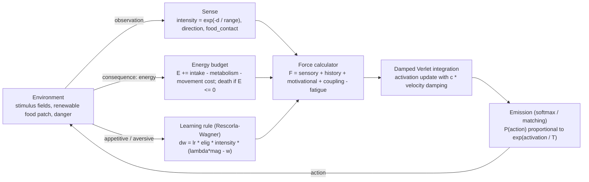

# Behavioral Molecular Dynamics Simulation Engine

[](https://github.com/david-j-cox/molecular-dynamics-ao/actions/workflows/ci.yml)

A Python framework that models an organism interacting with an environment using
an analogy to **molecular dynamics**, built to stay **objective and
non-mentalistic**: every term reduces to something measurable (energy expended,
distance moved, stimulus intensity, response strength), never a posited internal
state.

The organism is **not** a reinforcement-learning policy. It is a *distributed
dynamical system* of many coupled, response-capable units ("behavioral atoms").
Environmental stimuli act as **force fields**; learning history changes the
forces those stimuli produce; behavior emerges from integrating the coupled
dynamics over time. Survival is governed by an **energy budget** drawn from
behavioral ecology.

---

## Conceptual overview

In molecular dynamics, particles move through space under forces. Here,
behavioral atoms move through *activation space* under history-dependent
stimulus forces, integrated with a damped Verlet update. Behavior (the emitted
action) is read out from the atom activations.

| Engine term | Behavioral meaning (objective) |
|---|---|
| observation | sensory stimulation available to the organism |
| atom activation | response strength / response tendency |
| mass | behavioral inertia, resistance to change |
| force | current effective behavioral pull of the stimulus context given history |
| history weight | learning history (accumulated effect of consequences) |
| action | emitted behavior |
| reward/consequence | **change in energy** (food adds, danger removes); trains learning |
| energy reserve | physical state that governs survival and motivation |

### Two-tier architecture (functional response classes)

Learning lives on **drive atoms** — non-directional, sign-stable *functional
response classes* (`approach_food`, `avoid_danger`, `approach_light`,
`orient_to_cue`), each tagged with the `stimulus` it tracks and a `valence`
(+approach / −avoid). Their learned dispositions are **expressed** through
**movement atoms** (`move_up/down/left/right`) — topographies that carry no
learning of their own. This mirrors the behavior-analytic definition of an
**operant as a functional class defined by its outcome, not its topography**:
"approach food" is the operant; it is expressed through whatever movements the
environment makes available. (`consume` is a consummatory response; `pause` and
`explore` modulate movement.)

---

## Architecture

This engine grew from a hand sketch tying together the governing behavioral
equations, a "multiple-context" hierarchy of response units, and a dynamic
energy budget:


The diagrams below capture the **current implementation** in that spirit.

### Per-timestep loop



### Two-tier atom architecture (the "multiple-context" hierarchy)

Stimuli drive sign-stable **drive atoms** that carry the learning history; those
are *expressed* through topographic **movement atoms** via the live stimulus
geometry. Learning lives on the drive atoms, not the movements.


### Dynamic energy budget


### Quantitative laws from the sketch — implementation status

| Law (sketch) | In the engine | Status |
|---|---|---|
| Generalized matching law | softmax emission (Luce rule); `matching.py` concurrent VI-VI | implemented |
| Concatenated matching law | rate, amount, probability, delay (separable sensitivities) | implemented |
| Changeover delay (COD) | matching sensitivity rises with inter-patch travel (Shull & Pliskoff) | implemented |
| Patch-leaving / marginal-value theorem | `forage.py`: multi-patch salience; give-up density falls and residence rises with travel distance | implemented |
| Rescorla-Wagner + extinction | `learning.RescorlaWagner` (omission decay, asymmetric rates) | implemented |
| Stimulus generalization & peak shift | `generalization.CueReceptorField` (tuned receptors, summed error) | implemented |
| Schedule performance | `chamber.py`: FI scallop, FR break-and-run, FR>VR pause | implemented |
| Interval timing (SET / BeT / LeT) | `timing.py` pluggable timing models (toggleable) | implemented |
| Behavioral economics (effort / unit price) | `chamber.py`: consumption falls with response cost | implemented |
| Temporal weighting | eligibility trace (`EligibilityTrace`) | implemented (related) |
| Behavioral momentum | atom `mass` (unit inertia); `chamber.py` multiple schedule -- rich component resists satiation (molar) | partial |
| Delay/probability discounting | concatenated-law terms (matching) | implemented |
| Dynamic energy budget | `config` energy terms + `organism` bookkeeping | implemented |

---

## Governing equations

Notation: atom `i` has scalar activation `x_i` (state), mass `m_i`, timestep
`dt`. Stimulus channels `s ∈ {food, danger, light, cue}` each have intensity
`I_s` and unit direction `u_s` toward the source.

**Sensing (Shepard's universal law of generalization).** Intensity falls off
exponentially with distance `d_s`; a sharp binary `food_contact` signals being
on food:
```
I_s = exp(-d_s / sensor_range)
food_contact = 1 if d_food <= consume_radius else 0
```

**Behavioral force** (spec decomposition):
```
F_i = sensory_i + history_i + motivational_i + coupling_i - fatigue_i
```
- *Drive atoms* (non-directional):
  `sensory_i  = readiness_i * Σ_s sensitivity_i[s] * I_s^kᵢ`
  `history_i  = readiness_i * Σ_s w_i[s] * I_s^kᵢ`         (`w` = learned weights)
  `motivational_i = readiness_i * g(E) * I_food`           (food drive only)
  where `kᵢ` is the atom's `contact_exponent` (>1 sharpens to contact).
- *Movement atoms* (direction `d_i`) carry no sensitivity/history; they
  **express** the drive atoms through the live geometry:
  `F_express_i = Σ_k valence_k * x_k * (u_{stim_k} · d_i)`   (sum over drive atoms k)
- *Consummatory* (`consume`): driven by the sharp `food_contact` signal, so it
  fires only at food and (via coupling) holds the organism there.
- *Coupling*: `coupling_i = Σ_j C[i,j] * x_j` (e.g. `consume → movement = −1.5`
  so feeding suppresses locomotion; `pause → movement < 0`; `explore → movement > 0`).

**Convex marginal value of energy** (state-dependent foraging): a depleted
reserve produces stronger food-seeking, because energy is worth more nearer the
death boundary:
```
g(E) = motivational_strength * (1 - E/E_cap) ** deficit_exponent      (deficit_exponent ≥ 1, convex)
```

**Damped Verlet integration** (driven, dissipative dynamics; the overdamped
regime makes activation track current drive like a leaky accumulator, and gives
a Brunt–Väisälä-type restoring/relaxation reading):
```
v_i        = (x_i(t) - x_i(t-dt)) / dt
F_net      = F_i - c * v_i                              (c = damping_coef; c=0 -> literal pure Verlet)
x_i(t+dt)  = 2*x_i(t) - x_i(t-dt) + (F_net / m_i) * dt^2
x_i(t+dt)  = clip(x_i(t+dt), activation_min, activation_max)
```

**Action emission (Luce choice rule / matching law).** Over the action atoms:
```
P(action a) = exp(x_a / T) / Σ_b exp(x_b / T)           (T = softmax_temperature; T->0 -> argmax)
```

**Energy budget (objective bookkeeping).** Each step:
```
intake       = food_intake_rate           if in contact with food, else 0
energy_delta = intake - danger_loss * danger_contact
expenditure  = basal_metabolism + (move_cost if moved else rest_cost)
E(t+1)       = clip(E(t) + energy_delta - expenditure, 0, E_cap)
death (episode ends) when E <= 0     (cause: starvation, or danger if in contact)
```

**Eligibility trace (temporal weighting of credit).** Recency-weighted:
```
e_i(t) = eligibility_decay * e_i(t-1) + x_i(t)          (sweet spot ~0.9-0.95; 0.99 too long)
```

**Learning (two-tier, valence-split Rescorla–Wagner).** The consequence model
splits the consequence into `(appetitive, aversive)` teaching signals.
Approach-valence drives learn from `appetitive` (reinforcement), avoid-valence
drives from `aversive` (punishment); both *strengthen* the disposition (valence
handles direction in the expression). For drive atom `i` over present channels
`s`:
```
mag = appetitive if valence_i > 0 else aversive
RW:      Δw_i[s] = lr * e_i * I_s * (λ * mag - V_pred)
linear:  Δw_i[s] = lr * mag * e_i * I_s
w_i[s]  = clip(w_i[s] + Δw_i[s], history_weight_min, history_weight_max)
```
`credit_assignment` selects how `V_pred`/channels are handled:
`rw_independent` (per-channel error; enables cue conditioning/generalization),
`rw_competitive` (shared error → blocking/overshadowing), `source_only`.

**Stimulus generalization (population of cue receptors).** The cue varies along
an abstract scalar dimension `v ∈ [0,1]`, represented by `K` receptors tuned to
centers `c_k` with a Shepard kernel; each has a learned weight `w_k` updated by a
summed (elemental) prediction error:
```
receptor_k(v) = exp(-β |v - c_k|)
response(v)   = Σ_k w_k · receptor_k(v)
Δw_k          = lr_cue · e · receptor_k · (λ·mag - Σ_j w_j receptor_j)
```
The generalization gradient (and, after S+/S− discrimination, the **peak shift**)
emerge from the overlap of the tuning curves; the summed error lets a
non-reinforced cue drive overlapping receptors negative (inhibition).

---

## Mapping to established biobehavioral principles

| Mechanism | Grounding |
|---|---|
| `exp(-distance)` sensing & cue similarity | Shepard's universal law of generalization |
| softmax emission | Luce choice rule / generalized matching law (T ≈ sensitivity) |
| mass + velocity damping | behavioral momentum (resistance to change); MD Langevin friction; leaky competing accumulator |
| energy budget (vs. a motivating operation) | behavioral ecology / state-dependent foraging; objective energy bookkeeping |
| convex deficit drive | marginal value of energy / risk-sensitive foraging |
| valence-split RW; reinforcement ≠ punishment | Rescorla–Wagner; de Villiers (subtractive), Deluty (competitive), Klapes & Riley 2018, Klapes & McDowell 2025; Rasmussen & Newland 2008 |
| operant = functional class, not topography | two-tier drive→movement design |
| eligibility trace | temporal/recency weighting of credit |

---

## Key assumptions (current version)

- **Continuous world, no goal episodes.** Eating does not end the episode; the
  episode ends only at **death** (energy depletion) or truncation. Lives are long
  (target ~10,000 steps; 1 step = 15 min, 96 steps = 1 day).
- **Objectivism.** No mentalistic constructs. Motivation = energy reserve;
  consequence = change in energy; "value" is never posited.
- **Grid world** (default 10×10), discrete actions, for inspectability first.
- **Sensing is local** (`exp(-d/sensor_range)`), not omniscient.
- **Learning signals are normalized per event** (~1), while the energy *reserve*
  uses raw energy units (per-step energy amounts are too small to be useful RW
  targets). The reinforcement/punishment **asymmetry** is deferred to the
  pluggable `ConsequenceModel` variants (currently only `DeltaEnergy`).
- **Reproducible**: all randomness is seeded via `SimulationConfig.seed`.
- See `ToDO.txt` for what is not yet implemented (day/night, operant schedules,
  multiple food patches, the punishment-asymmetry models, tests).

---

## Demonstrations

A range of classic behavior-analytic phenomena are reproduced from the same
mechanism. The `scripts/` demos run agent populations (use `--agents N`) and write
figures with 95% CI bands; the `experiments/` sweeps (`exp0NN`) cover matching,
schedules, timing, and the JAX engine.

**Foraging / learning** (`scripts/`):

| Demonstration | Script | Result |
|---|---|---|
| Acquisition | `run_demo.py` | latency to food falls (~185 → ~78 steps) across lives |
| Extinction | `run_extinction_demo.py` | trained food weight decays ~1.0 → ~0 when food stops reinforcing |
| Generalization | `run_generalization_demo.py` | response gradient peaked at the trained cue value |
| Peak shift | `run_peak_shift_demo.py` | after S+/S− discrimination, the peak shifts *past* S+ away from S− |

**Choice & matching** (`matching.py`; patches signalled by discriminative cues, not
separate food channels):

| Phenomenon | Experiment | Result |
|---|---|---|
| Generalized matching | `exp008` | undermatching (a≈0.7), classic log-log GML |
| Changeover delay | `exp009` | sensitivity rises with travel/COD (Shull & Pliskoff) |
| Multi-alternative matching | `exp010` | near-perfect matching across 5 alternatives |
| Concatenated law: amount / probability / delay | `exp011`/`exp013`/`exp014` | separable sensitivities per dimension |

**Operant chamber & schedules** (`chamber.py`, `timing.py`):

| Phenomenon | Experiment | Result |
|---|---|---|
| FI scallop | `exp017` | flat-then-accelerating; toggleable timing models (SET/BeT/LeT) |
| FR break-and-run, FR>VR pause | `exp018`/`exp019` | post-reinforcement pause larger on FR; cumulative records |
| Behavioral economics | `exp016` | consumption falls as response cost (unit price) rises |
| Death patterns | `exp007` | survival curves, time-to-death, cause breakdown |

**Parameter fitting** (`fit.py`, `matching_diff.py`): search organism parameters so
the *emergent* matching sensitivities hit chosen targets (`exp023`). The stochastic
engine is non-differentiable, so we built a differentiable Gumbel-softmax surrogate of
the rollout — but reverse-mode gradients through the long recurrent rollout explode
(per-step sensitivities compound multiplicatively), so autodiff itself is unusable, and
a molar closed-form (where it would work) would have to *assume* the matching-law form,
defeating emergence. The surrogate's *forward* model is faithful and deterministic under
common random numbers, so we search it derivative-free (Nelder-Mead) and re-plug the
fit into the stochastic engine to confirm transfer. On the two-patch preparation the
free discriminability levers (`temperature`, `approach_gain`, `beta`) move `a_rate` and
`a_amt` together, so on their own the fit can only tune them in aligned directions —
stochastic `a_rate` 0.56 → 0.66 (up) / 0.36 (down), `a_amt` 0.97 → 1.06 / 0.86.

**Decoupling them** (`exp024`) needs an *asymmetric* lever, since every discriminability
knob — including patch separation/COD — scales both sensitivities together (a finding:
exp009 had only ever measured rate vs COD). Adding a reinforcer-magnitude sensitivity
exponent `amount_exponent` (value tracks `amount^ρ`, utility curvature) gives one:
because `a_rate` is measured at equal amounts (`amount^ρ = 1`), `ρ` scales `a_amt` while
leaving `a_rate` exactly flat. With `beta` for rate and `ρ` for amount, the fit hits
*crossing* targets impossible before — high-rate/low-amount (stoch 0.59/0.61) vs
low-rate/high-amount (0.39/1.20). See the lab notebook (2026-06-02) for the full diagnosis.

`scripts/make_figures.py` regenerates the standard foraging figure set (occupancy
landscape, energy/biomass traces, learning curves, force-decomposition grid).

## Performance (JAX engine)

`jax_engine.py` is a JAX-vectorized twin of the NumPy engine: the whole
population is held as arrays and one timestep is a pure, `jit`-compiled, batched
operation run over time with `lax.scan`. It is validated component-by-component
against the NumPy reference (force, learning, emission, environment all match to
≤1e−7) and runs **~84× faster** on CPU (XLA). The NumPy engine remains the readable,
canonical reference. (Autodiff is exposed by the JAX engine, but note that gradients
through the long recurrent matching rollout explode — see the parameter-fitting note
above; the differentiable surrogate is searched derivative-free in practice.)

```bash
python -m behavioral_md.jax_engine        # run the equivalence checks
python -m experiments.exp004_jax_benchmark  # JAX vs NumPy speed
```

---

## Repository layout

```
src/behavioral_md/
  config.py              # SimulationConfig (all parameters, pydantic)
  atoms.py               # BehavioralAtom, verlet_update, default_atom_set (two-tier)
  forces.py              # ForceCalculator (drives + movement expression), coupling
  consequence.py         # ConsequenceModel (DeltaEnergy default; asymmetry stubs)
  learning.py            # EligibilityTrace + pluggable LearningRule (Rescorla-Wagner / linear)
  generalization.py      # CueReceptorField (tuned receptors; generalization & peak shift)
  matching.py            # concurrent VI-VI via discriminative cues; concatenated matching law
  matching_diff.py       # differentiable Gumbel-softmax surrogate of the matching rollout
  fit.py                 # search organism params to target matching sensitivities (derivative-free)
  chamber.py             # operant chamber: press response, FR/VR/FI/VI, effort/unit-price
  timing.py              # pluggable interval-timing models (none/SET/BeT/LeT)
  metrics.py             # death patterns: time-to-death, cause breakdown, survival curve
  organism.py            # Organism: sense -> force -> damped Verlet -> emit -> learn; energy/death
  simulation.py          # run_episode / run_simulation + long-format DataLogger
  parallel.py            # run_sweep: multiprocessing across organisms / parameter cells
  jax_engine.py          # JAX-vectorized fast twin (jit + scan); validated vs NumPy
  visualization.py       # matplotlib figures (house style: B&W, despined, 95% CI)
  environments/
    gridworld.py         # BehavioralFieldEnv (Gymnasium); stimulus fields, energy, death
scripts/                 # run_demo, run_extinction_demo, run_generalization_demo,
                         #   run_peak_shift_demo, make_figures  (each takes --agents N)
experiments/             # reproducible sweeps/benchmarks (exp001-024) + parallel helper
docs/lab_notebook.md     # running record of every experiment and decision
docs/architecture/       # the original design sketch
outputs/                 # logs/ and figures/ (generated; gitignored)
```

## Installation

```bash
python -m venv .venv
source .venv/bin/activate
pip install -r requirements.txt
pip install -e .
pip install -e ".[jax]"                        # optional: JAX-vectorized engine
python scripts/run_demo.py                     # acquisition demo (writes a figure)
```
(pygame is optional — `pip install pygame` — for the live render; it has no
prebuilt wheel on some new Python versions.)

Reproduce every finding and guard against drift with the reproduction harness,
which runs all experiments and demos and snapshots their results:

```bash
python scripts/reproduce.py                    # capture baseline -> outputs/repro/
python scripts/reproduce.py --check            # re-run and diff vs the baseline
```

Optional — enable the local pre-commit guard (mirrors CI: ruff on commit, pytest
on push) so local can't drift from CI. Run with the venv active:

```bash
pre-commit install                          # ruff on commit
pre-commit install --hook-type pre-push     # pytest on push
```

## Status

- [x] **Phase 1** — package scaffold, `SimulationConfig`, `BehavioralFieldEnv`
- [x] **Phase 2** — `BehavioralAtom`, force model, Verlet integrator
- [x] **Phase 3** — `Organism`, learning, simulation loop, logging
- [x] **Phase 4** — damped Verlet + softmax; objective energy budget; persistent
  lives; two-tier valence-split learning; consummatory competition.
- [x] **Learning phenomena** — acquisition, extinction (pluggable
  `LearningRule`), generalization, and peak shift (cue receptor population).
- [x] **Choice & matching** — concurrent VI-VI via discriminative cues; the
  changeover-delay effect; multi-alternative matching; the concatenated matching
  law (rate / amount / probability / delay).
- [x] **Operant chamber & schedules** — FI scallop, FR break-and-run, FR>VR pause
  (cumulative records); pluggable interval-timing models (SET / BeT / LeT);
  effort-based / unit-price consumption.
- [x] **JAX-vectorized engine** — validated vs NumPy, ~84× faster (autodiff-ready).
- [x] **Tests + CI** — 32-test pytest suite, GitHub Actions (ruff + pytest).
- [ ] **Next** — molar VR≫VI rate difference; behavioral momentum (molar);
  day/night ambient sun; multiple food patches; punishment-asymmetry consequence
  models; using the JAX autodiff for fitting → evolution → model comparison →
  real data (see `ToDO.txt`).
