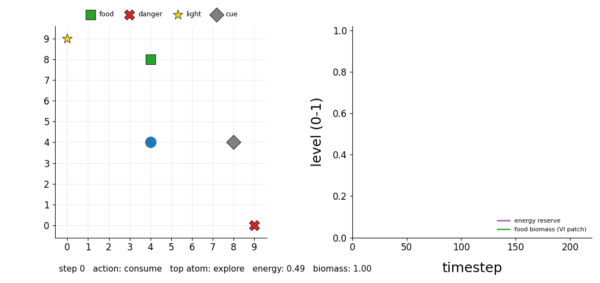
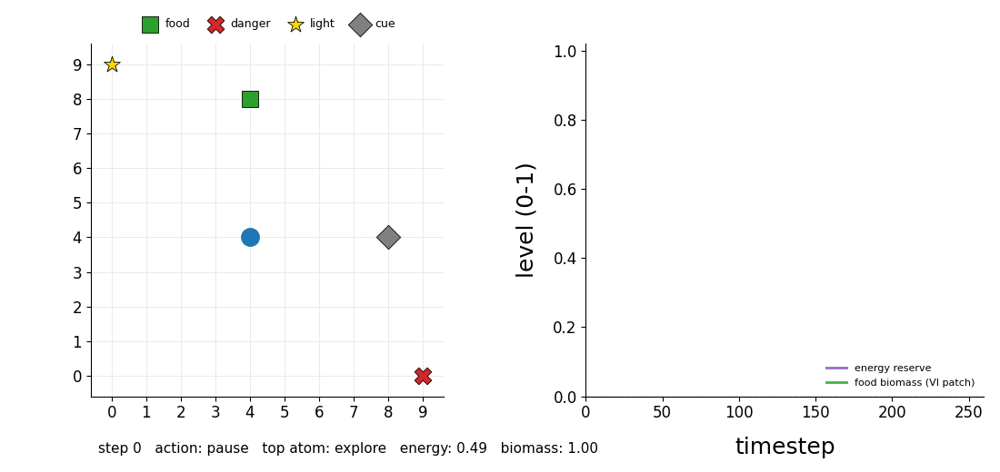
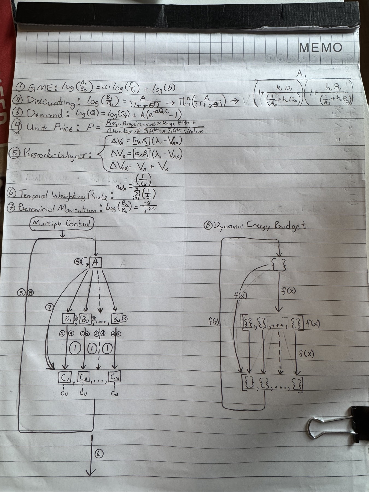
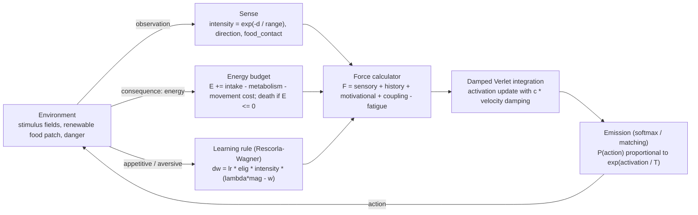
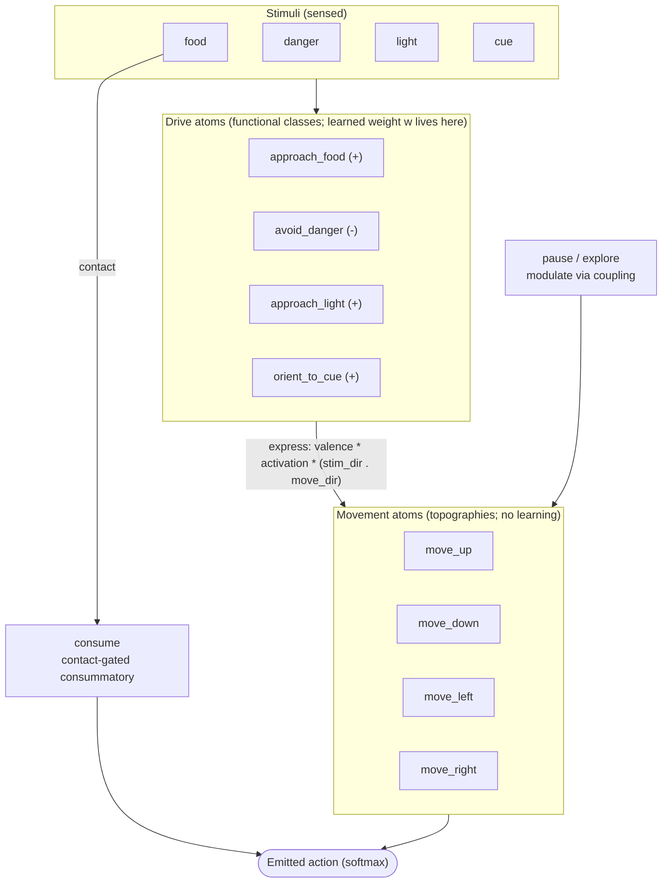
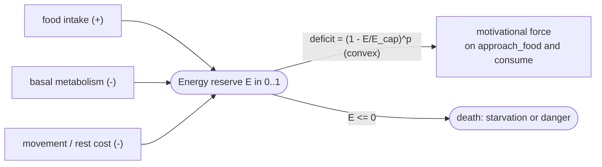

# Behavioral Molecular Dynamics Simulation Engine

[](https://github.com/david-j-cox/molecular-dynamics-ao/actions/workflows/ci.yml)

A Python framework that models an organism interacting with an environment using
an analogy to **molecular dynamics**, built to stay **objective and
non-mentalistic**: every term reduces to something measurable (energy expended,
distance moved, stimulus intensity, response rate/probability), never a posited internal
state.

The organism is **not** a reinforcement-learning policy. It is a *distributed
dynamical system* of many coupled, response-capable units ("behavioral atoms").
Environmental stimuli act as **force fields**; learning history changes the
forces those stimuli produce; behavior emerges from integrating the coupled
dynamics over time. Survival is governed by an **energy budget** drawn from
behavioral ecology.

## See it run



*A trained organism foraging in the gridworld (left): its position and recent trail, the
food/danger/light/cue sources, and the current action and most-active atom each step; the energy
reserve (purple, right) dips toward starvation on the trek to food, then the organism reaches the
patch and sustains itself by foraging it (the food marker and the green biomass trace show the patch
state). Nothing here is scripted, the path is read out from the coupled atom dynamics. Regenerate
with `python scripts/run_animation_demo.py`.*

**Variable-interval foraging.** The patch follows logistic depletion/regrowth, which acts like a
variable-interval (VI) schedule: a spent patch only pays again after it has regrown.



*Same engine, slower-regrowing patch with a low floor: the food marker shrinks as the patch is eaten
and grows back as it regrows, and the green biomass trace (right) is a clean sawtooth against the
energy reserve (purple). The organism harvests the patch, leaves as it depletes and its food signal
fades, and returns once it has regrown. Regenerate with `python scripts/run_vi_foraging_demo.py`.*

---

## Conceptual overview

In molecular dynamics, particles move through space under forces. Here,
behavioral atoms move through *activation space* under history-dependent
stimulus forces, integrated with a damped Verlet update. Behavior (the emitted
action) is read out from the atom activations.

| Engine term | Behavioral meaning (objective) |
|---|---|
| observation | sensory stimulation available to the organism |
| atom activation | momentary probability of emitting the response (a model variable) |
| mass | behavioral inertia, resistance to change |
| force | current effective behavioral pull of the stimulus context given history |
| history weight | learning history (accumulated effect of consequences) |
| action | emitted behavior |
| reward/consequence | **change in energy** (food adds, danger removes); trains learning |
| energy reserve | physical state that governs survival and motivation |

### Two-tier architecture (functional response classes)

Learning lives on **drive atoms** — non-directional, sign-stable *functional
response classes* (`approach_food`, `avoid_danger`, `approach_light`,
`orient_to_cue`), each tagged with the `stimulus` it tracks and a `valence`
(+approach / −avoid). Their learned dispositions are **expressed** through
**movement atoms** (`move_up/down/left/right`) — topographies that carry no
learning of their own. This mirrors the behavior-analytic definition of an
**operant as a functional class defined by its outcome, not its topography**:
"approach food" is the operant; it is expressed through whatever movements the
environment makes available. (`consume` is a consummatory response; `pause` and
`explore` modulate movement.)

---

## Architecture

This engine grew from a hand sketch tying together the governing behavioral
equations, a "multiple-context" hierarchy of response units, and a dynamic
energy budget:



The diagrams below capture the **current implementation** in that spirit.

### Per-timestep loop



### Two-tier atom architecture (the "multiple-context" hierarchy)

Stimuli drive sign-stable **drive atoms** that carry the learning history; those
are *expressed* through topographic **movement atoms** via the live stimulus
geometry. Learning lives on the drive atoms, not the movements.



### Dynamic energy budget



### Quantitative laws from the sketch — implementation status

| Law (sketch) | In the engine | Status |
|---|---|---|
| Generalized matching law | softmax emission (Luce rule); `matching.py` concurrent VI-VI | implemented |
| Concatenated matching law | rate, amount, probability, delay — separable, and each independently tunable via its own curvature lever | implemented |
| Changeover delay (COD) | matching sensitivity rises with inter-patch travel (Shull & Pliskoff) | implemented |
| Patch-leaving / marginal-value theorem | `forage.py`: multi-patch salience; give-up density falls and residence rises with travel distance | implemented |
| Punishment / reinforcement asymmetry | three concurrent-choice accounts (subtractive/de Villiers, competitive/Deluty, concatenated/Klapes) in `chamber.run_punishment_choice`; foraging `consequence.Subtractive`/`ConcatenatedAsymmetric`; exp029 + `studies/punishment_asymmetry/` | implemented |
| Risk-sensitive foraging (energy-budget rule) | `chamber.run_risk_choice` (energy-budget rule given a survival utility) and `survival.survival_dp` (the rule *derived* from energy + death dynamics, no imposed utility); risk-prone below the requirement, risk-averse above (Caraco); exp030 + `studies/risk_sensitivity/` | implemented |
| Rescorla-Wagner + extinction | `learning.RescorlaWagner` (omission decay, asymmetric rates) | implemented |
| Dual excitatory/inhibitory extinction | `learning.DualExcitatoryInhibitory` (separate w+/w-, context-gated); spontaneous recovery, renewal, rapid reacquisition | implemented |
| Stimulus generalization & peak shift | `generalization.CueReceptorField` (tuned receptors, summed error); also on the JAX engine (`exp044`) | implemented |
| Cue competition: blocking & overshadowing | shared (competitive) prediction error in `learning.RescorlaWagner` (`credit_assignment="rw_competitive"`); `exp039` | implemented |
| Operant stimulus control (S+/S-delta/neutral) | three-term contingency over the cue dimension; differential responding + generalization decrement (`run_stimulus_control_demo.py`) | implemented |
| Behavioral contrast | from the shared energy budget (convex hunger): current-reserve and learned-anticipatory routes (`chamber.run_contrast`, `exp040`/`exp041`) | implemented |
| Schedule performance | `chamber.py`: FI scallop, FR break-and-run, FR>VR pause | implemented |
| VR > VI rate difference | molar feedback sensitivity (response-reinforcer correlation; `chamber.feedback_gain`, Baum's correlation-based law); `exp047` | implemented |
| Interval timing (SET / BeT / LeT) | `timing.py` pluggable timing models (toggleable) | implemented |
| Behavioral economics (effort / unit price) | `chamber.py`: consumption falls with response cost | implemented |
| Temporal weighting | eligibility trace (`EligibilityTrace`) | implemented (related) |
| Behavioral momentum | atom `mass` (unit inertia); `chamber.py` multiple schedule -- rich component resists satiation (molar) and, via mass-modulated value decay, extinction (`run_multiple_schedule`, exp026) | implemented |
| Partial-reinforcement extinction effect (PREE) | Pearce-Hall associability (rate ~ recent \|prediction error\|); `chamber.run_pree`, exp027 -- PRF persists longer in extinction | implemented |
| Resurgence | emergent from choice reallocation; four distinct mechanisms (local choice, momentum, dual exc/inhib, Resurgence-as-Choice) in `chamber.run_resurgence`, exp028; model-mimicry study in `studies/resurgence_mechanisms/` | implemented |
| Delay/probability discounting | concatenated-law terms (matching) | implemented |
| Dynamic energy budget | `config` energy terms + `organism` bookkeeping | implemented |

---

## Governing equations

Notation: atom `i` has scalar activation `x_i` (state), mass `m_i`, timestep
`dt`. Stimulus channels `s ∈ {food, danger, light, cue}` each have intensity
`I_s` and unit direction `u_s` toward the source.

**Sensing (Shepard's universal law of generalization).** Intensity falls off
exponentially with distance `d_s`; a sharp binary `food_contact` signals being
on food:
```
I_s = exp(-d_s / sensor_range)
food_contact = 1 if d_food <= consume_radius else 0
```

**Behavioral force** (spec decomposition):
```
F_i = sensory_i + history_i + motivational_i + coupling_i - fatigue_i
```
- *Drive atoms* (non-directional):
  `sensory_i  = readiness_i * Σ_s sensitivity_i[s] * I_s^kᵢ`
  `history_i  = readiness_i * Σ_s w_i[s] * I_s^kᵢ`         (`w` = learned weights)
  `motivational_i = readiness_i * g(E) * I_food`           (food drive only)
  where `kᵢ` is the atom's `contact_exponent` (>1 sharpens to contact).
- *Movement atoms* (direction `d_i`) carry no sensitivity/history; they
  **express** the drive atoms through the live geometry:
  `F_express_i = Σ_k valence_k * x_k * (u_{stim_k} · d_i)`   (sum over drive atoms k)
- *Consummatory* (`consume`): driven by the sharp `food_contact` signal, so it
  fires only at food and (via coupling) holds the organism there.
- *Coupling*: `coupling_i = Σ_j C[i,j] * x_j` (e.g. `consume → movement = −1.5`
  so feeding suppresses locomotion; `pause → movement < 0`; `explore → movement > 0`).

**Convex marginal value of energy** (state-dependent foraging): a depleted
reserve produces stronger food-seeking, because energy is worth more nearer the
death boundary:

```math
g(E) = \mu \left(1 - \frac{E}{E_\text{cap}}\right)^{p}, \qquad p \ge 1\ \text{(convex)}
```

with `μ = motivational_strength` and `p = deficit_exponent`.

**Damped Verlet integration** (driven, dissipative dynamics; the overdamped
regime makes activation track current drive like a leaky accumulator, and gives
a Brunt–Väisälä-type restoring/relaxation reading):

```math
\begin{aligned}
v_i &= \frac{x_i(t) - x_i(t-dt)}{dt}, \qquad F_\text{net} = F_i - c\,v_i \\
x_i(t+dt) &= 2\,x_i(t) - x_i(t-dt) + \frac{F_\text{net}}{m_i}\,dt^2 \\
x_i(t+dt) &\leftarrow \mathrm{clip}\left(x_i(t+dt),\ x_{\min},\ x_{\max}\right)
\end{aligned}
```

with `c = damping_coef` (`c=0` → literal pure Verlet); activations are clipped to
`[activation_min, activation_max]`.

**Action emission (Luce choice rule / matching law).** Over the action atoms:

```math
P(a) = \frac{\exp(x_a / T)}{\sum_b \exp(x_b / T)}
```

with `T = softmax_temperature` (`T → 0` → argmax).

**Energy budget (objective bookkeeping).** Each step:
```
intake       = food_intake_rate           if in contact with food, else 0
energy_delta = intake - danger_loss * danger_contact
expenditure  = basal_metabolism + (move_cost if moved else rest_cost)
E(t+1)       = clip(E(t) + energy_delta - expenditure, 0, E_cap)
death (episode ends) when E <= 0     (cause: starvation, or danger if in contact)
```

**Eligibility trace (temporal weighting of credit).** Recency-weighted:

```math
e_i(t) = \gamma\, e_i(t-1) + x_i(t)
```

with `γ = eligibility_decay` (sweet spot ~0.9-0.95; 0.99 is too long).

**Learning (two-tier, valence-split Rescorla–Wagner).** The consequence model
splits the consequence into `(appetitive, aversive)` teaching signals.
Approach-valence drives learn from `appetitive` (reinforcement), avoid-valence
drives from `aversive` (punishment); both *strengthen* the disposition (valence
handles direction in the expression). For drive atom `i` over present channels
`s`, with teaching magnitude `mag = appetitive if valence_i > 0 else aversive`:

```math
\begin{aligned}
\text{RW:} \quad & \Delta w_i[s] = \eta\, e_i\, I_s\,(\lambda\,\text{mag} - V_\text{pred}) \\
\text{linear:} \quad & \Delta w_i[s] = \eta\,\text{mag}\, e_i\, I_s
\end{aligned}
```

with `η = lr`, `λ` the asymptote, `V_pred` the prediction, and `w_i[s]` clipped to
`[history_weight_min, history_weight_max]`.
`credit_assignment` selects how `V_pred`/channels are handled:
`rw_independent` (per-channel error; enables cue conditioning/generalization),
`rw_competitive` (shared error → blocking/overshadowing), `source_only`.

**Stimulus generalization (population of cue receptors).** The cue varies along
an abstract scalar dimension `v ∈ [0,1]`, represented by `K` receptors tuned to
centers `c_k` with a Shepard kernel; each has a learned weight `w_k` updated by a
summed (elemental) prediction error:
```
receptor_k(v) = exp(-β |v - c_k|)
response(v)   = Σ_k w_k · receptor_k(v)
Δw_k          = lr_cue · e · receptor_k · (λ·mag - Σ_j w_j receptor_j)
```
The generalization gradient (and, after S+/S− discrimination, the **peak shift**)
emerge from the overlap of the tuning curves; the summed error lets a
non-reinforced cue drive overlapping receptors negative (inhibition).

---

## Mapping to established biobehavioral principles

| Mechanism | Grounding |
|---|---|
| `exp(-distance)` sensing & cue similarity | Shepard's universal law of generalization |
| softmax emission | Luce choice rule / generalized matching law (T ≈ sensitivity) |
| mass + velocity damping | behavioral momentum (resistance to change); MD Langevin friction; leaky competing accumulator |
| energy budget (vs. a motivating operation) | behavioral ecology / state-dependent foraging; objective energy bookkeeping |
| convex deficit drive | marginal value of energy / risk-sensitive foraging |
| valence-split RW; reinforcement ≠ punishment | Rescorla–Wagner; de Villiers (subtractive), Deluty (competitive), Klapes & Riley 2018, Klapes & McDowell 2025; Rasmussen & Newland 2008 |
| operant = functional class, not topography | two-tier drive→movement design |
| eligibility trace | temporal/recency weighting of credit |

---

## Key assumptions (current version)

- **Continuous world, no goal episodes.** Eating does not end the episode; the
  episode ends only at **death** (energy depletion) or truncation. Lives are long
  (target ~10,000 steps; 1 step = 15 min, 96 steps = 1 day).
- **Objectivism.** No mentalistic constructs. Motivation = energy reserve;
  consequence = change in energy; "value" is never posited.
- **Grid world** (default 10×10), discrete actions, for inspectability first.
- **Sensing is local** (`exp(-d/sensor_range)`), not omniscient.
- **Learning signals are normalized per event** (~1), while the energy *reserve*
  uses raw energy units (per-step energy amounts are too small to be useful RW
  targets). The reinforcement/punishment **asymmetry** is deferred to the
  pluggable `ConsequenceModel` variants (currently only `DeltaEnergy`).
- **Reproducible**: all randomness is seeded via `SimulationConfig.seed`.
- See `ToDO.txt` for what is not yet implemented (day/night, operant schedules,
  multiple food patches, the punishment-asymmetry models, tests).

---

## Demonstrations

A range of classic behavior-analytic phenomena are reproduced from the same
mechanism. The `scripts/` demos run agent populations (use `--agents N`) and write
figures with 95% CI bands; the `experiments/` sweeps (`exp0NN`) cover matching,
schedules, timing, cue competition, behavioral contrast, risk sensitivity, the JAX
engine, parameter fitting, and parameter-range robustness.

**Foraging / learning** (`scripts/`):

| Demonstration | Script | Result |
|---|---|---|
| Acquisition | `run_demo.py` | latency to food falls (~185 → ~78 steps) across lives |
| Extinction | `run_extinction_demo.py` | trained food weight decays ~1.0 → ~0 when food stops reinforcing |
| Generalization | `run_generalization_demo.py` | response gradient peaked at the trained cue value (also on JAX: `exp044`) |
| Peak shift | `run_peak_shift_demo.py` | after S+/S− discrimination, the peak shifts *past* S+ away from S− (also on JAX: `exp044`) |
| Operant stimulus control | `run_stimulus_control_demo.py` | a response reinforced under S+ but not S-delta comes under stimulus control: responding diverges (S+ ~0.88 vs S-delta ~0.50), graded by cue similarity, with a generalization decrement to a novel neutral cue |
| Rapid reacquisition | `run_reacquisition_demo.py` | dual exc/inhib rule reacquires far faster than original acquisition (and than RW) — w+ preserved |
| Spontaneous recovery | `run_spontaneous_recovery_demo.py` | net recovers over a rest interval (inhibition decays, excitation preserved), then re-extinguishes |
| Renewal (ABA vs ABB) | `run_renewal_demo.py` | extinguished responding returns in the acquisition context (A), not the extinction context (B) |

**Choice & matching** (`matching.py`; patches signalled by discriminative cues, not
separate food channels):

| Phenomenon | Experiment | Result |
|---|---|---|
| Generalized matching | `exp008` | undermatching (a≈0.56), classic log-log GML |
| Changeover delay | `exp009` | sensitivity rises with travel/COD (Shull & Pliskoff) |
| Multi-alternative matching | `exp010` | near-perfect matching across 5 alternatives |
| Concatenated law: amount / probability / delay | `exp011`/`exp013`/`exp014` | separable sensitivities per dimension |
| Sensitivity fitting & decoupling | `exp023`/`exp024`/`exp025` | fit emergent sensitivities to targets; rate/amount and probability/delay independently tunable (see **Parameter fitting** below) |

**Operant chamber & schedules** (`chamber.py`, `timing.py`):

| Phenomenon | Experiment | Result |
|---|---|---|
| FI scallop | `exp017` | flat-then-accelerating; toggleable timing models (SET/BeT/LeT) |
| FR break-and-run, FR>VR pause | `exp018`/`exp019` | post-reinforcement pause larger on FR; cumulative records |
| VR > VI rate difference | `exp047` | VR press rate exceeds VI at matched reinforcement rate (VR/VI ~1.7 with molar feedback sensitivity vs ~1.0 without) |
| Behavioral economics | `exp016` | consumption falls as response cost (unit price) rises |
| Death patterns | `exp007` | survival curves, time-to-death, cause breakdown |
| Behavioral momentum (extinction) | `exp026` | mass-modulated value decay → richly-reinforced response resists extinction; gain=0 control shows none |
| Partial-reinforcement extinction effect | `exp027` | Pearce-Hall associability → PRF persists longer in extinction than CRF; fixed-associability control shows none |
| Resurgence | `exp028` | extinguished R1 recovers when the alternative R2 is extinguished — emergent from choice reallocation; control (R2 kept reinforced) abolishes it |
| Punishment asymmetry | `exp029` | three accounts all suppress the punished response, but subtractive (de Villiers) and competitive (Deluty) suppression depend on the alternative's reinforcement with opposite slopes; concatenated `a_p` recovered log-linearly |
| Risk-sensitive foraging | `exp030` | the energy-budget rule: risk-prone below the energy requirement, risk-averse above; emerges from a survival-shaped utility; flat under a linear-utility control |

**Cue competition & behavioral contrast** (`exp039`–`exp043`):

| Phenomenon | Experiment | Result |
|---|---|---|
| Blocking & overshadowing | `exp039` | shared (competitive) prediction error blocks/overshadows the redundant cue (w_B 0.00 / 0.50); independent credit shows neither |
| Behavioral contrast (current reserve) | `exp040` | worsening a component makes the organism hungrier → more responding in the other (positive); enriching → less (negative); from the convex shared energy budget, knocked out by removing hunger |
| Behavioral contrast (anticipatory) | `exp041` | a learned predicted-income term discounts current hunger → respond *less* before a rich component, *more* before a lean one (the correct anticipatory sign) |
| Robustness battery | `exp042`/`exp043` | the new and core phenomena hold across parameter ranges, with mechanism knockouts flat — standing model-validity evidence |

**Molecular ↔ molar bridge** (`exp032`–`exp037`, `exp045`, `studies/molecular_molar_bridge/`): the
energy-budget rule does not emerge from per-step atom dynamics; a bare period-scale **survival**
fact, credited by an eligibility trace, reproduces it with an *emergent* requirement (no utility),
generalizes, and gives the twin-threshold rule. The learning ports to the atom weights; expression
needs timescale separation, and spatial travel cost can invert the rule. A real **2D forager**
(`exp045`) reproduces the rule end-to-end on the engine's own primitives (reversal +0.23, drive-readout
emission; travel weakens it; the raw per-step Verlet+softmax emission under-builds). A travel-cost
study (`exp046`, `studies/spatial_travel_cost/`) maps the rule→inversion transition and finds it is
economy-coupled, not a clean single-parameter boundary.

**Parameter fitting** (`fit.py`, `matching_diff.py`): search organism parameters so
the *emergent* matching sensitivities hit chosen targets (`exp023`). The stochastic
engine is non-differentiable, so we built a differentiable Gumbel-softmax surrogate of
the rollout — but reverse-mode gradients through the long recurrent rollout explode
(per-step sensitivities compound multiplicatively), so autodiff itself is unusable, and
a molar closed-form (where it would work) would have to *assume* the matching-law form,
defeating emergence. The surrogate's *forward* model is faithful and deterministic under
common random numbers, so we search it derivative-free (Nelder-Mead) and re-plug the
fit into the stochastic engine to confirm transfer. On the two-patch preparation the
free discriminability levers (`temperature`, `approach_gain`, `beta`) move `a_rate` and
`a_amt` together, so on their own the fit can only tune them in aligned directions —
stochastic `a_rate` 0.56 → 0.66 (up) / 0.36 (down), `a_amt` 0.97 → 1.06 / 0.86.

**Decoupling them** needs *asymmetric* levers, since every discriminability knob —
including patch separation/COD — scales all the sensitivities together (a finding:
exp009 had only ever measured rate vs COD). The pattern that emerges is clean: **rate is
the frequency anchor** (set by the discriminability levers), and **each graded dimension
gets its own orthogonal utility-curvature exponent**:

| dimension | lever | mechanism |
|---|---|---|
| amount | `amount_exponent` (ρ) | value tracks `amount^ρ` |
| delay | `delay_k` | steepness of the hyperbolic delay discount (pre-existing) |
| probability | `probability_exponent` (σ) | reinforcement gated on `prob^σ` (nonlinear probability weighting) |

Each leaves the other sensitivities exactly flat because the other sweeps hold that
dimension neutral (`amount=1`, `prob=1`, `delay=0` → `1^x=1`, `discount(0)=1`). So the
fit hits *crossing* targets impossible on the coupled manifold: `exp024` decouples
rate/amount (high-rate/low-amount stoch 0.59/0.61 vs low-rate/high-amount 0.39/1.20),
and `exp025` decouples probability/delay (high-prob/low-delay stoch 0.93/0.45 vs
low-prob/high-delay 0.50/0.64). All four generalized-matching-law sensitivities are
independently tunable. See the lab notebook (2026-06-02) for the full diagnosis.

`scripts/make_figures.py` regenerates the standard foraging figure set (occupancy
landscape, energy/biomass traces, learning curves, force-decomposition grid).

## Performance (JAX engine)

`jax_engine.py` is a JAX-vectorized twin of the NumPy engine: the whole
population is held as arrays and one timestep is a pure, `jit`-compiled, batched
operation run over time with `lax.scan`. It is validated component-by-component
against the NumPy reference (force, learning, emission, environment all match to
≤1e−7) and runs **~84× faster** on CPU (XLA). The NumPy engine remains the readable,
canonical reference. (Autodiff is exposed by the JAX engine, but note that gradients
through the long recurrent matching rollout explode — see the parameter-fitting note
above; the differentiable surrogate is searched derivative-free in practice.)

```bash
python -m behavioral_md.jax_engine        # run the equivalence checks
python -m experiments.exp004_jax_benchmark  # JAX vs NumPy speed
```

---

## Repository layout

```
src/behavioral_md/
  config.py              # SimulationConfig (all parameters, pydantic)
  atoms.py               # BehavioralAtom, verlet_update, default_atom_set (two-tier)
  forces.py              # ForceCalculator (drives + movement expression), coupling
  consequence.py         # ConsequenceModel (DeltaEnergy default + optional graded teaching;
                         #   Subtractive / ConcatenatedAsymmetric punishment asymmetry)
  learning.py            # EligibilityTrace + pluggable LearningRule (Rescorla-Wagner w/ competitive
                         #   credit -> blocking/overshadowing; linear; dual exc/inhib extinction)
  generalization.py      # CueReceptorField (tuned receptors; generalization & peak shift)
  matching.py            # concurrent VI-VI via discriminative cues; concatenated matching law
  matching_diff.py       # differentiable Gumbel-softmax surrogate of the matching rollout
  fit.py                 # search organism params to target matching sensitivities (derivative-free)
  chamber.py             # operant chamber + populations: schedules (FR/VR/FI/VI), concurrent
                         #   matching, multiple schedule (momentum), contrast, PREE, resurgence,
                         #   punishment choice, risk choice
  survival.py            # survival DP + evolved/learned/model-free risk policies (energy-budget rule)
  forage.py              # multi-patch foraging, give-up density, Charnov functional response (MVT)
  timing.py              # pluggable interval-timing models (none/SET/BeT/LeT)
  metrics.py             # death patterns: time-to-death, cause breakdown, survival curve
  organism.py            # Organism: sense -> force -> damped Verlet -> emit -> learn; energy/death
  simulation.py          # run_episode / run_simulation + long-format DataLogger
  parallel.py            # run_sweep: multiprocessing across organisms / parameter cells
  jax_engine.py          # JAX-vectorized fast twin (jit + scan); validated vs NumPy
  visualization.py       # matplotlib figures (house style: B&W, despined, 95% CI)
  environments/
    gridworld.py         # BehavioralFieldEnv (Gymnasium); stimulus fields, energy, death
scripts/                 # run_demo, run_extinction_demo, run_generalization_demo,
                         #   run_peak_shift_demo, run_stimulus_control_demo,
                         #   run_reacquisition_demo, run_spontaneous_recovery_demo,
                         #   run_renewal_demo, run_animation_demo, run_vi_foraging_demo,
                         #   make_figures, reproduce  (demos take --agents N)
experiments/             # reproducible sweeps/benchmarks (exp001-044) + parallel helper
studies/                 # focused write-ups (risk_sensitivity, resurgence_mechanisms,
                         #   punishment_asymmetry, molecular_molar_bridge, ...)
docs/lab_notebook.md     # running record of every experiment and decision
docs/architecture/       # the original design sketch
docs/media/              # demo GIFs embedded in this README
outputs/                 # logs/ and figures/ (generated; gitignored)
```

## Installation

```bash
python -m venv .venv
source .venv/bin/activate
pip install -r requirements.txt
pip install -e .
pip install -e ".[jax]"                        # optional: JAX-vectorized engine
python scripts/run_demo.py                     # acquisition demo (writes a figure)
```
(pygame is optional — `pip install pygame` — for the live render; it has no
prebuilt wheel on some new Python versions.)

Reproduce every finding and guard against drift with the reproduction harness,
which runs all experiments and demos and snapshots their results:

```bash
python scripts/reproduce.py                    # capture baseline -> outputs/repro/
python scripts/reproduce.py --check            # re-run and diff vs the baseline
```

Optional — enable the local pre-commit guard (mirrors CI: ruff on commit, pytest
on push) so local can't drift from CI. Run with the venv active:

```bash
pre-commit install                          # ruff on commit
pre-commit install --hook-type pre-push     # pytest on push
```

## Status

- [x] **Phase 1** — package scaffold, `SimulationConfig`, `BehavioralFieldEnv`
- [x] **Phase 2** — `BehavioralAtom`, force model, Verlet integrator
- [x] **Phase 3** — `Organism`, learning, simulation loop, logging
- [x] **Phase 4** — damped Verlet + softmax; objective energy budget; persistent
  lives; two-tier valence-split learning; consummatory competition.
- [x] **Learning phenomena** — acquisition, extinction (pluggable
  `LearningRule`), generalization, and peak shift (cue receptor population).
- [x] **Dual excitatory/inhibitory extinction** (`dual_exc_inhib`) — extinction builds
  a separate, context-specific inhibition (w-) on top of a preserved excitation (w+),
  reproducing spontaneous recovery, renewal (ABA), and rapid reacquisition.
- [x] **Choice & matching** — concurrent VI-VI via discriminative cues; the
  changeover-delay effect; multi-alternative matching; the concatenated matching
  law (rate / amount / probability / delay).
- [x] **Operant chamber & schedules** — FI scallop, FR break-and-run, FR>VR pause
  (cumulative records); pluggable interval-timing models (SET / BeT / LeT);
  effort-based / unit-price consumption; the **VR > VI rate difference**, which *requires* molar
  feedback sensitivity (the response-reinforcer correlation, Baum's correlation-based law; `exp047`,
  opt-in `feedback_gain`) — molecular per-step routes (per-press value, response cost, IRT) give only
  ~1.0–1.2×; the molar term gives ~1.7×. VR>VI is irreducibly marginal (average per-press quantities
  equalize at matched reinforcement rate), reproducing the molar-vs-molecular tension in the literature.
- [x] **JAX-vectorized engine** — validated vs NumPy, ~84× faster. (Autodiff is
  exposed, but gradients through the long recurrent matching rollout explode and are
  unusable for fitting; fitting instead searches the differentiable forward surrogate
  derivative-free — see below.)
- [x] **Patch-leaving / MVT** — multi-patch foraging (`forage.py`); give-up density
  falls and residence rises with travel distance; Charnov functional response.
- [x] **Parameter fitting & sensitivity decoupling** — search organism parameters so
  the *emergent* generalized-matching-law sensitivities hit chosen targets (`exp023`),
  validated by re-plugging into the stochastic engine. Each graded dimension's
  sensitivity is independently controllable via its own utility-curvature lever
  (`amount_exponent`, `probability_exponent`, `delay_k`), with rate the frequency
  anchor: rate/amount (`exp024`) and probability/delay (`exp025`) are decoupled to
  crossing targets that the shared discriminability levers could not reach.
- [x] **Resistance to change, PREE & resurgence** — mass-modulated value decay gives
  behavioral momentum under *extinction* (`exp026`, with a gain=0 control that shows
  none); Pearce-Hall associability (rate ~ recent |prediction error|) produces the
  partial-reinforcement extinction effect (`exp027`, with a fixed-associability control);
  and resurgence emerges from choice reallocation — no resurgence-specific code — with a
  control (alternative kept reinforced) that abolishes it (`exp028`).
- [x] **Resurgence model-mimicry study** (`studies/resurgence_mechanisms/`) — four
  mechanistically distinct processes (local choice, behavioral momentum, dual
  excitatory/inhibitory, and Resurgence-as-Choice; Shahan & Craig, 2017) all reproduce
  resurgence under the *identical* preparation, so the phenomenon underdetermines the
  process. Two reinforcement-rate dissociations reproduce Craig & Shahan (2016): only
  momentum makes resurgence depend on *target* reinforcement history. The writeup
  catalogs each mechanism's benefits/drawbacks and the experiments needed to distinguish
  them.
- [x] **Reinforcement/punishment asymmetry** (`exp029`, `studies/punishment_asymmetry/`) —
  three accounts of punishment in concurrent choice (subtractive/de Villiers,
  competitive/Deluty, concatenated/Klapes) all suppress the punished response but
  dissociate on its dependence on the alternative's reinforcement (opposite slopes); the
  same asymmetry, via the foraging `ConsequenceModel`, traces an approach-avoidance
  gradient that tips into maladaptive over-avoidance.
- [x] **Obtained-rate confound** (`studies/obtained_rate_confound/`) — a methodological
  finding: because a punisher is collected only when the punished response is emitted, the
  *obtained* punishment rate is inverted-U in the *scheduled* rate, so fitting the matching
  law on obtained rates can recover a punishment sensitivity of the **wrong sign** (+2.04
  on scheduled vs −2.24 on obtained). Use scheduled/programmed rates.
- [x] **Day/night ambient sun + risk-sensitive foraging** — a global light cycle grading
  perception (`config.day_night`; `studies/.../` notebook records that a *stationary*
  deterministic hazard cannot yield risk-sensitivity). Risk-sensitivity done properly via
  **outcome variance** and the **energy-budget rule** (`exp030`,
  `studies/risk_sensitivity/`): a survival-shaped utility makes the organism risk-prone
  below the energy requirement and risk-averse above (Caraco), in both reward-variance and
  predation-variance preparations, with a flat risk-neutral control. **Derived from first
  principles** (`survival.survival_dp`): a survival DP over a day/night cycle yields the rule
  with *no* imposed utility — a risk-prone band whose requirement (`night_steps × metabolism`)
  and ruin edge both emerge. It **evolves** (`survival.evolve_risk_policy`) — a population
  with a heritable state-dependent risk trait, selected only by survival, converges on the
  DP-optimal threshold. And it is **learned within life** (`survival.simulate_learning_choice`)
  — an organism that starts not knowing which option is risky discovers it from experience and
  plans the rule — and, most strictly, by **model-free reinforcement**
  (`survival.simulate_model_free_choice`): tabular survival values learned from living and dying,
  no model and no planning, still recovering the DP-optimal threshold. The same energy-budget
  rule at six levels (imposed → derived → executed → evolved → learned model-based → learned
  model-free), from progressively fewer assumptions; see `studies/risk_sensitivity/`.
- [x] **Day/night sun → foraging variance** (`survival.sun_variance_risky`,
  `survival_dp_timevarying`) — the Phase 5 sun, repurposed to set the *variance* of foraging
  (dark = erratic) rather than a fixed hazard: high-variance dark foraging is a lifeline near
  the deadline (the dusk ruin edge drops) and a liability far from it. Closes the Phase 5 loop.
  Realized as behavior (`survival.simulate_dusk_survival`, `behavioral_sun.py`): organisms
  dropped into dusk behind on reserves survive the night from a *lower* reserve under the sun
  (+0.25 peak survival advantage in the desperate band, zero once reserves are safe).
- [x] **Richer worlds — continuous outcomes + skew** (`survival.skewed_outcomes`,
  `richer_worlds.py`) — a continuous gamble removes the two-point reachability comb (the band is
  survival, not the grid), and the energy-budget rule *extends to the third moment*: at fixed
  mean and variance the skew preference reverses at the requirement (negative skew when building
  the buffer, positive skew when safe) — a higher-moment effect mean-variance theory can't express.
- [x] **Multi-patch foraging — risk-sensitive choice + finite-horizon MVT**
  (`survival.survival_dp_patches`, `survival_dp_depleting`, `multi_patch.py`) — patch choice is a
  three-way energy-budget rule (safe / rich-rate-maximizing / wild-variance by energy and
  time-of-day), and the giving-up rule is finite-horizon (leaving stops near dusk, cutoff tracking
  the travel cost). Survival refines the risk-neutral MVT of `exp020`; MVT is its not-desperate limit.
- [x] **Cue competition & behavioral contrast** (`exp039`–`exp041`) — blocking and overshadowing
  from a shared (competitive) prediction error (`credit_assignment="rw_competitive"`), absent under
  independent credit; behavioral contrast from the shared energy budget (convex hunger), both the
  current-reserve route (worsen/enrich one component → more/less responding in the other) and a
  learned **anticipatory** route (predicted upcoming income discounts current urgency, giving the
  correct sign), each with a mechanism knockout.
- [x] **Operant stimulus control** (`run_stimulus_control_demo.py`) — the three-term contingency
  S: R → C over the cue dimension: a response reinforced under S+ but not S-delta comes under
  stimulus control (responding diverges to S+ ~0.88 vs S-delta ~0.50 over training), is graded by
  cue similarity, and shows a generalization decrement to a novel neutral cue.
- [x] **Molecular ↔ molar bridge** (`exp032`–`exp037`, `exp045`, `studies/molecular_molar_bridge/`)
  — the energy-budget rule does not emerge from per-step atom dynamics; a bare period-scale
  **survival** fact, credited by an eligibility trace, reproduces it with an *emergent* requirement
  (no utility), generalizes, and yields the twin-threshold rule. The learning ports to the atom
  weights; expression needs timescale separation, and spatial travel cost can invert the rule. A real
  **2D forager** (`exp045`) reproduces it end-to-end on the engine's own primitives (drive-readout
  emission; the raw per-step Verlet+softmax emission under-builds, the exp036 limit).
- [x] **Robustness battery** (`exp042`/`exp043`) — the new and core phenomena hold across parameter
  ranges on the current engine (signatures flat, or scaling monotonically with the mechanism
  parameter; knockouts flat) as standing model-validity evidence. Generalization and peak shift also
  run on the JAX engine (`exp044`).
- [x] **Tests + CI** — 104-test pytest suite, GitHub Actions (ruff + pytest).
- [ ] **Next** — `InjuryHealing` consequence model; Pearce-Hall as a pluggable foraging
  `LearningRule`; combined-dimension GML; a genuine autodiff fit via truncated backprop →
  evolution → model comparison → real data (see `ToDO.txt`).
