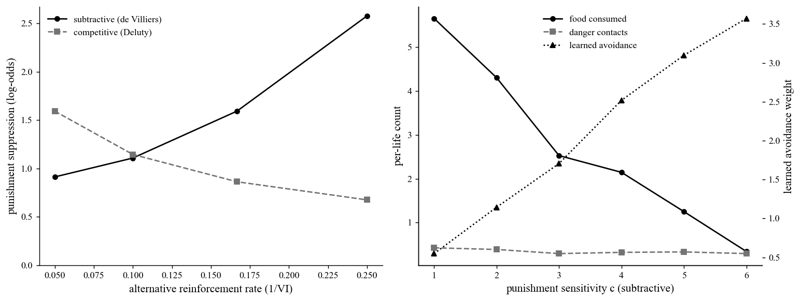
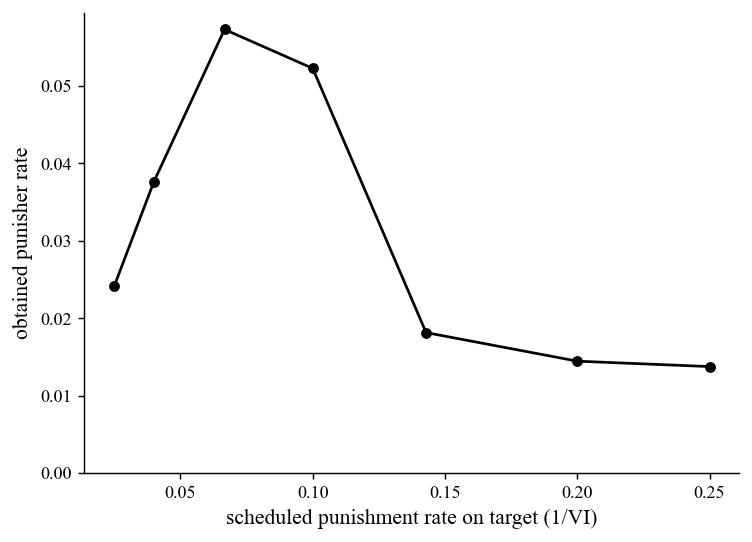
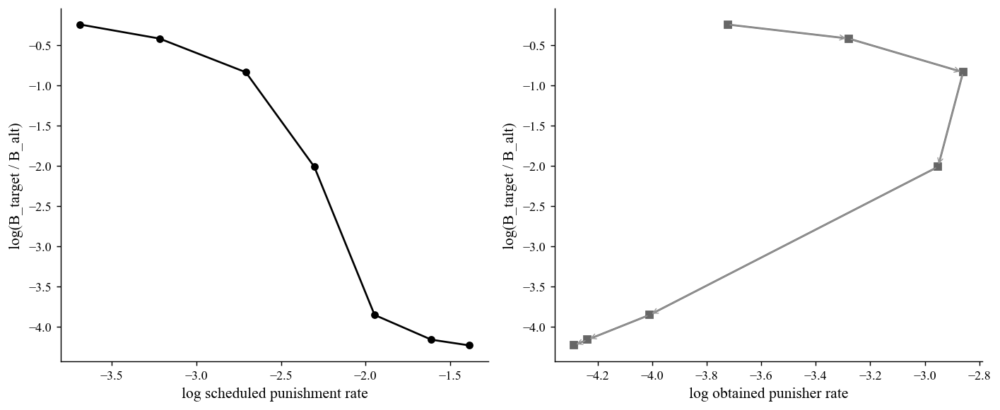

# Three accounts of punishment, one suppression: a model-mimicry analysis of the reinforcement/punishment asymmetry

*A short collaboration brief for outreach. It is not a finished manuscript.*

For: punishment and choice researchers (quantitative analysis of behavior, applied and clinical behavior analysis, translational work on response suppression) David J. Cox would be glad to develop the full paper with.

## Abstract

Reinforcement and punishment are not symmetric, and how punishment controls choice has been argued for fifty years. In a behavioral molecular-dynamics engine we implement three leading accounts of punishment in a concurrent operant chamber: subtractive, in which a punisher cancels a fixed number of the response's own reinforcers (de Villiers, 1980); competitive, in which a punisher strengthens the alternatives (Deluty, 1976); and concatenated, power-law matching with a separate punishment sensitivity (Critchfield, Paletz, MacAleese, & Newland, 2003). All three suppress the punished response, so suppression by itself cannot tell them apart. A parametric manipulation can: as the alternative's reinforcement rate rises, subtractive suppression increases while competitive suppression decreases, the cleanest single dissociation. The concatenated law recovers a punishment sensitivity that tracks its set value and is separable from the reinforcement term. We then formalize a measurement hazard the same engine exposes. Because a punisher is collected only when the punished response is emitted, the obtained punishment rate is inverted-U in the scheduled rate, and fitting on the obtained rather than the scheduled rate flips the recovered sensitivity from about +2.0 to about -2.2. A second, embodied preparation casts the asymmetry as approach-avoidance: raising punishment sensitivity drives learned avoidance up and foraging success down, until the organism over-avoids the danger guarding its food and starves. These are minimal, illustrative mechanisms; the contribution is a diagnostic roadmap and a measurement caution toward a formal model comparison of punishment.

*Keywords:* punishment; response suppression; choice/matching; model mimicry; concatenated matching law; approach-avoidance.

## Method

### Preparation 1: concurrent choice

We simulated punishment in a discrete-time concurrent-operant chamber (`run_punishment_choice`), averaging over 600 organisms and reading allocation off the steady state (the second half of a 5000-step run). Two responses are each on their own reinforcement variable-interval (VI) schedule and, independently, their own punishment VI. A VI arms Bernoulli at rate $1/\text{VI}$; an armed reinforcer or punisher is collected when its response is emitted. Each response carries two temporally weighted values, one for reinforcement and one for punishment, and one response is emitted per step by matching over a model-specific score.

### The timestep update

Each response $i$ carries a reinforcement value $v^{r}_i$ and a punishment value $v^{p}_i$. Both are leaky-integrated tallies of the events that response has produced, updated every step toward the events it just collected:

$$v^{r}_i \leftarrow \rho\,v^{r}_i + b\,\mathbb{1}[\text{reinforced}], \qquad v^{p}_i \leftarrow \rho\,v^{p}_i + b\,\mathbb{1}[\text{punished}],$$

with retention $\rho = 1 - 1/\tau$ and step gain $b$. On each step the engine forms a model-specific score from these two values, converts scores to choice probabilities by matching, and emits one response. The three accounts differ only in how the punishment value enters the score:

$$\text{subtractive (de Villiers, 1980):}\quad \text{score}_i = (v^{r}_i + k) - c\,v^{p}_i,$$

a punisher cancels $c$ units of the response's own reinforcement value;

$$\text{competitive (Deluty, 1976):}\quad \text{score}_i = (v^{r}_i + k) + c\!\!\sum_{j\neq i} v^{p}_j,$$

a punisher strengthens the competing responses (relative suppression);

$$\text{concatenated (Critchfield/Klapes):}\quad B_i \propto (v^{r}_i + k)^{a_r}\,(v^{p}_i + k)^{-a_p},$$

so that $\log(B_1/B_2) = a_r\log(v^{r}_1/v^{r}_2) - a_p\log(v^{p}_1/v^{p}_2) + \text{bias}$, power-law matching with a punishment sensitivity $a_p$ separate from the reinforcement sensitivity $a_r$. For the subtractive and competitive accounts allocation matches a power of the score, $P(i)\propto\text{score}_i^{\,s}$; for the concatenated account $P(i)\propto B_i$. The floor $k$ keeps scores positive. Full parameter values are in `compare_models.py`.

### Preparation 2: open foraging

In the survival world, danger is the punisher, routed through the pluggable `ConsequenceModel`. The subtractive consequence model scales the aversive teaching signal by a punishment sensitivity $c$, so a danger event trains the organism's avoid-danger drive $c$ times more strongly than a food event trains approach. With a food source up the column and an avoidable danger off to the side, we swept $c$ and recorded per-life food consumed, danger contacts, and the learned avoidance weight, averaging over 36 organisms and their asymptotic lives.

### The obtained-rate measurement sweep

To expose the measurement hazard we ran a single-target version: two responses equally reinforced (VI 5), the target punished at a rising scheduled rate, the alternative unpunished, averaged over 800 organisms. We recorded the scheduled punishment rate, the obtained punisher rate, and the log allocation ratio, and recovered the punishment sensitivity by regressing log allocation on log rate, once against the scheduled rate and once against the obtained rate.

## Results at a glance

All three accounts suppress, so the basic result does not discriminate them. Adding punishment to one response reduces allocation to it under every account; suppression per se is mimicry, the same underdetermination problem the resurgence study (`studies/resurgence_mechanisms/`) found for relapse.

The de Villiers versus Deluty dissociation. Punishing the target at a fixed rate and varying the alternative's reinforcement rate ($1/\text{VI}$ = 0.05, 0.10, 0.17, 0.25) separates the two value accounts by the sign of their slope. Subtractive suppression rises with alternative richness (log-odds 0.91, 1.11, 1.59, 2.58): as the alternative gets richer the target is emitted and reinforced less, so its small reinforcement value is more easily pushed below the floor by a fixed subtraction. Competitive suppression falls (1.59, 1.15, 0.86, 0.68): a punisher works by boosting the competitor, and that boost matters less when the competitor is already strong. The opposite-slope prediction is the single cleanest test (Figure 1, left).

The concatenated law separates the sensitivities. With both responses punished and the punishment ratio swept, the emergent $\log(B_1/B_2)$ is log-linear ($R^2 \geq 0.998$) and recovers a punishment sensitivity that tracks the set value (set 0.5, 1.0, 1.5 recovered 0.74, 1.52, 2.35), separable from the reinforcement term. This is the Critchfield/Klapes result reproduced in the engine.

The obtained-rate confound. Fitting the concatenated law on obtained punishment rate is endogenous, because a punisher is collected only when the punished response is emitted and punishment suppresses that emission. As the scheduled rate on the target rises, the obtained rate first rises and then collapses, an inverted-U peaking near a scheduled rate of 0.067 (Figure 2). Real suppression is meanwhile monotone: log allocation falls steadily from -0.24 to -4.23 across the sweep. Plotted against the scheduled rate the suppression is clean, and the recovered sensitivity is +2.04 (correct). Plotted against the obtained rate the points fold back on the descending limb, where allocation and obtained punishment fall together, and the fitted slope flips sign to a recovered sensitivity of -2.24 (Figure 3). The artifact is unique to punishment, which has negative response feedback; reinforcement has positive feedback, so its obtained-rate fit is biased only in magnitude, never in sign. It is worst near response elimination, the regime applied and clinical work cares about most.

The foraging asymmetry as approach-avoidance. In the survival world, raising the punishment sensitivity $c$ from 1 to 6 climbs the learned avoidance weight monotonically (0.55, 1.14, 1.71, 2.52, 3.10, 3.57) while per-life food intake falls (5.7, 4.3, 2.5, 2.1, 1.2, 0.3). At high sensitivity the organism over-avoids: it gives the danger a wide berth, fails to reach the food the danger guards, and starves (Figure 1, right). The asymmetry that protects the organism from harm, pushed too far, costs it the resource. This is the same sensitivity seen from the survival side, setting where the organism draws the line between food and safety rather than how it allocates between two levers.

### Diagnostic catalog: which manipulation isolates which account

| Manipulation | subtractive (de Villiers) | competitive (Deluty) | concatenated (Critchfield/Klapes) | What it isolates |
|---|---|---|---|---|
| Alternative reinforcement rate up | suppression rises | suppression falls | (depends on both terms) | Subtractive vs competitive (simulated; the diagnostic) |
| Remove the alternative (no competitor) | suppression persists | suppression weakens | persists | Competitive vs the rest (proposed) |
| Both responses punished, ratio swept | no separate term | no separate term | recovers separable $a_p$ | The concatenated claim (simulated) |
| Fit on obtained vs scheduled rate | sign flips on obtained | sign flips on obtained | sign flips on obtained | Measurement, not mechanism (simulated) |
| Punisher magnitude / devaluation | does a fixed $c$ scale with magnitude? | competitor boost scales | $a_p$ should track magnitude | Whether $c$ is fixed (proposed) |
| Embodied survival cost (foraging) | over-avoidance, starvation at high $c$ | not expressible in foraging | not expressible in foraging | Asymmetry as approach-avoidance (simulated) |

Reading the table: the alternative-reinforcement slope is the workhorse dissociation between the two value accounts; the both-punished ratio sweep is where the concatenated law stakes its separable-sensitivity claim; the obtained-versus-scheduled contrast is a measurement check every fit should pass before mechanism is inferred; and the foraging cost carries the asymmetry into an embodied setting the chamber cannot reach.

## Figures

Figure 1. *The reinforcement/punishment asymmetry in two preparations.* Left: the de Villiers versus Deluty dissociation in the concurrent chamber. The y-axis is punishment suppression of the target as a log-odds difference; the x-axis is the alternative's reinforcement rate ($1/\text{VI}$, richer to the right). Subtractive suppression (solid black, circles) rises with alternative richness; competitive suppression (dashed gray, squares) falls. The opposite slopes are the diagnostic. Right: the asymmetry as approach-avoidance in the open-foraging world, plotted against the punishment sensitivity $c$ (x-axis). Food consumed per life (solid black, circles, left axis) falls as the learned avoidance weight (dotted black, triangles, right axis) climbs, while danger contacts (dashed gray, squares, left axis) stay low. At high $c$ the organism over-avoids and starves.

Figure 2. *Obtained punishment rate is inverted-U in the scheduled rate.* The y-axis is the obtained punisher rate; the x-axis is the scheduled punishment rate on the target ($1/\text{VI}$). Because a punisher is collected only on an emission and punishment suppresses emission, the obtained rate first rises with the scheduled rate, peaks near 0.067, then collapses as allocation to the target dies. The obtained rate is therefore a function of the behavior it would be used to predict.

Figure 3. *Fitting on the obtained rate flips the sign of the recovered sensitivity.* Both panels plot log target allocation, $\log(B_\text{target}/B_\text{alt})$, on the y-axis. Left: against the log scheduled punishment rate, suppression is clean and monotone, and the recovered punishment sensitivity is +2.04 (correct). Right: against the log obtained punisher rate, the points fold back on themselves (arrows trace the sweep order); on the descending limb allocation and obtained punishment fall together, so the fitted slope turns positive and the recovered sensitivity flips to -2.24. Same data, opposite conclusion, from the choice of independent variable.

## Open questions / where a collaborator could come in

These are the threads we would most want a co-author to pull.

1. Run the decisive choice tests against data. The alternative-reinforcement slope (subtractive rises, competitive falls) and a remove-the-alternative manipulation (competitive suppression should weaken with no competitor to strengthen, subtraction should not) are the experiments, and the datasets, that would adjudicate the two value accounts.

2. Build the formal model comparison. The mechanisms here are minimal implementations in one shared engine, not the published quantitative models. The real contribution would fit the actual de Villiers, Deluty, and contemporary concatenated punishment models (Klapes, Riley, & McDowell) to a common dataset spanning the diagnostic manipulations, so the dissociations carry quantitative weight.

3. Pin the obtained-rate confound in real data. Re-analyze published punishment-matching fits on scheduled versus obtained rates, report where the obtained rate turns over, and quantify how far toward response elimination a study has to push before the bias matters. The fix is to use scheduled rates, to jointly model the response-feedback function, or to restrict the fit to the pre-collapse regime.

4. Settle whether the asymmetry parameter is fixed or scales. Reinforcer and punisher magnitude and devaluation manipulations test whether $c$ (or $a_p$) is a constant cost or scales with punisher magnitude (Rasmussen & Newland, 2008).

5. Carry the asymmetry into the embodied setting. The foraging result raises a translational question worth formalizing: when is high punishment sensitivity adaptive and when does it become maladaptive over-avoidance? A delayed, embodied punisher with temporary repertoire impairment (`InjuryHealing`) is the natural next preparation.

If this framing of the punishment-mimicry problem and its diagnostic and measurement tests is of interest, we would welcome conversation about developing the full paper together.

*Sources: the README, analysis code (`compare_models.py`, `feedback_bias.py`), and `figures/summary.json` in the `punishment_asymmetry` and `obtained_rate_confound` study folders. All numbers and citations are drawn directly from those files.*
