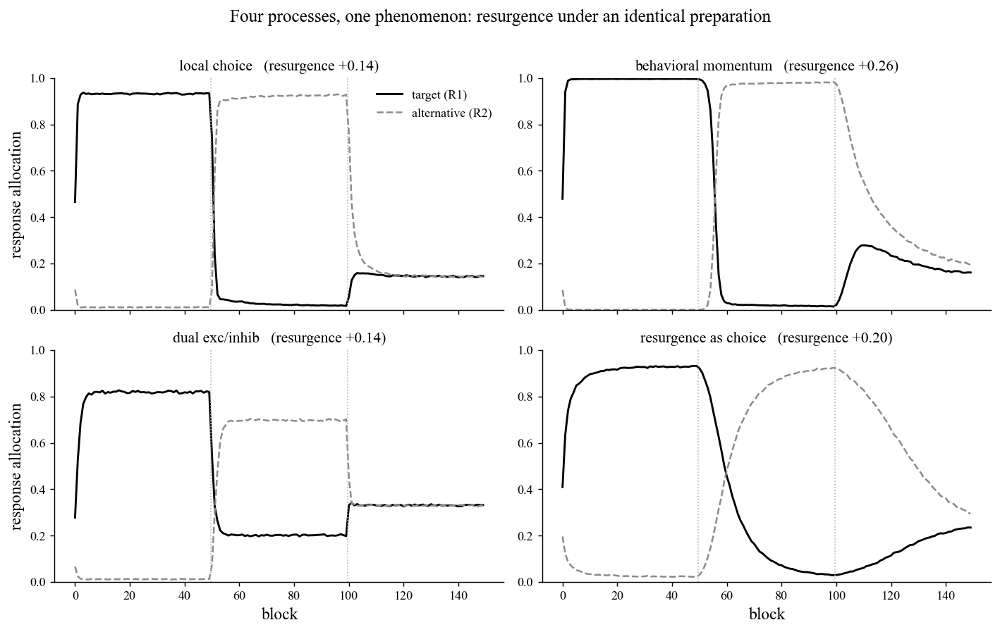
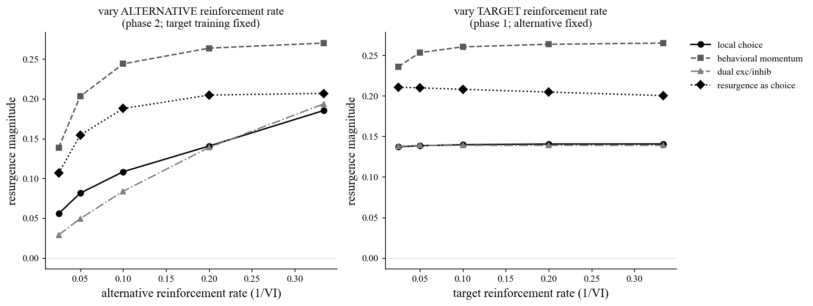

# Four processes, one phenomenon: a model mimicry analysis of resurgence

*A short collaboration brief for outreach. It is not a finished manuscript.*

For: resurgence and relapse researchers (experimental analysis of behavior, animal learning, translational relapse models) David J. Cox would be glad to develop the full paper with.

## Abstract

Resurgence is the recovery of a previously reinforced, then extinguished, target response when a more recently reinforced alternative is itself extinguished. It is a workhorse model of relapse. In a behavioral molecular-dynamics engine, we show that at least four mechanistically distinct processes all reproduce the canonical resurgence curve under one identical three-phase preparation (train the target R1, reinforce the alternative R2, then test both under extinction): local choice (a delta-rule value read out by softmax matching), behavioral momentum (a reinforcement-history mass that slows the target's extinction decay; Nevin & Grace, 2000), a dual excitatory-inhibitory rule (extinction builds a context-specific inhibition while a latent target excitation survives; Konorski, 1967; Bouton, 2004), and Resurgence as Choice (a molar, temporally weighted value with power-law matching; Shahan & Craig, 2017). All four are abolished by a reinforced-alternative control, so recovery reflects choice reallocation. The phenomenon therefore underdetermines the process. Parametric sweeps then locate where the accounts diverge. Varying the alternative's reinforcement rate raises resurgence in every mechanism and so cannot discriminate them, consistent with the empirical record (Leitenberg, Rawson, & Mulick, 1975). Varying the target's own reinforcement rate separates them: only behavioral momentum predicts that resurgence grows with target reinforcement history, a prediction that sits uneasily with documented difficulties for momentum accounts of resurgence (Craig & Shahan, 2016). These are minimal, illustrative mechanisms; the contribution is a diagnostic roadmap toward a formal model comparison.

*Keywords:* resurgence; relapse; model mimicry; behavioral momentum; Resurgence as Choice; extinction; choice/matching.

## Method

### Preparation

We simulated resurgence in a discrete-time concurrent-operant chamber (`run_resurgence`), averaging over 500 independent organisms. At each timestep an organism emits exactly one of three options: the target R1, the alternative R2, or a background response with a fixed extraneous value (Herrnstein's $R_e$). The session runs in three equal phases. Phase 1 trains R1 on a variable-interval (VI) schedule with R2 on extinction; phase 2 reinforces R2 and places R1 on extinction; phase 3 places both on extinction. Energy is decoupled, so extinction withholds only the response-to-reinforcer contingency. A control that keeps R2 reinforced in phase 3 abolishes resurgence, confirming that recovery is driven by removing the alternative's reinforcement (Leitenberg, Rawson, & Mulick, 1975; Winterbauer & Bouton, 2010). Resurgence is read off the record as the rise of R1 in phase 3 above its end-of-phase-2 level; the engine never computes it.

### The timestep update

Each option $i$ carries a value $V_i$. On every step the engine converts values to choice probabilities, emits one option, reinforces the phase's scheduled response when it is emitted and its VI timer has armed, and then updates values. For three of the four mechanisms the values feed a leaky-integrated activation $a_i$ and a softmax (local matching) over R1, R2, and $R_e$:

$$a_i \leftarrow (1-\tfrac{1}{\tau_a})\,a_i + \tfrac{1}{\tau_a}\,g\,V_i, \qquad P(i)\;\propto\;\exp(a_i/\tau).$$

Values follow an error-correcting (delta) rule toward a reinforcement asymptote $\lambda$ when reinforced, and decay proportionally toward zero on a non-reinforced emission. The decay is applied per step (time-based), so vigorous responding is not self-penalized:

$$\text{reinforced:}\quad V_i \leftarrow V_i + \eta(\lambda - V_i); \qquad \text{emitted, not reinforced:}\quad V_i \leftarrow V_i - \tfrac{\delta}{m_i}\,V_i.$$

The four mechanisms differ only in the value term and how it is read out.

- Local choice: a single value with plain decay ($m_i = 1$); the target's value erodes toward the background floor during extinction.
- Behavioral momentum: the same value, but its decay is divided by a mass $m_i = 1 + g_m\,s_i$, where $s_i$ is a slowly decaying reinforcement-history trace (Nevin & Grace, 2000). More training builds more mass, slows phase-2 decay, and leaves more latent target strength at test.
- Dual excitatory/inhibitory: behavior is driven by a net $V_i = w^{+}_i - w^{-}_i$. Reinforcement grows the excitation $w^{+}$ by the delta rule, while a non-reinforced emission grows a separate inhibition $w^{-}$ (which also relaxes on reinforcement and decays passively). Extinction builds inhibition rather than erasing excitation, so a latent target excitation survives phase 2 (Konorski, 1967; Bouton, 2004).
- Resurgence as choice: a molar account with no activation step (Shahan & Craig, 2017). Each value is a leaky-integrated tally of the reinforcers the option has produced, $V_i \leftarrow (1-\tfrac{1}{\tau_r})\,V_i + b\,r_i$, and allocation matches relative value as a power law, $P(i) \propto (V_i + \text{floor})^{s}$, over R1, R2, and $R_e$. Resurgence emerges as the alternative's integrated value decays once its reinforcement stops.

Full parameter values for each mechanism are listed in `compare_mechanisms.py`.

### Dissociation sweeps

To find manipulations that separate the mechanisms, we swept the VI schedule (plotted as reinforcement rate $1/\text{VI}$, richer to the right) two ways: varying the alternative's phase-2 rate with target training fixed, and varying the target's phase-1 rate with the alternative fixed.

## Results at a glance

The basic result underdetermines the process (mimicry). As shown in Figure 1, all four mechanisms reproduce the canonical resurgence curve under the identical preparation: target responding is high in phase 1, suppressed in phase 2, and recovers in phase 3. They differ only in shape and in the level to which the target is suppressed. For local choice, the target was suppressed to a phase-2 level of 0.019 and recovered to a peak of 0.159 (resurgence +0.141). For behavioral momentum, suppression reached 0.015 and the target overshot to 0.279 (resurgence +0.264). For the dual rule, the target was suppressed only to a high floor of 0.202, reflecting the preserved excitation, and rose to 0.341 (resurgence +0.139). For resurgence as choice, suppression reached 0.031 and the target recovered as a slow, transient hump to 0.236 (resurgence +0.205). Because the four produce the same qualitative phenomenon and shape is parameter-sensitive, the basic resurgence curve does not by itself discriminate among the processes.

The clean dissociation: target reinforcement rate. As shown in Figure 2, the alternative-rate sweep is non-diagnostic. All four mechanisms predict that resurgence increases with the alternative's richness, differing only in functional form (local choice rising from 0.056 to 0.185; behavioral momentum from 0.139 to 0.270; dual from 0.029 to 0.193; resurgence as choice from 0.107 to 0.207 across VI 40 to VI 3). The target-rate sweep separates the mechanisms cleanly. Local choice was flat (0.137 to 0.141), the dual rule was flat (0.138 to 0.139), and resurgence as choice was flat to slightly declining (0.211 to 0.200). Only behavioral momentum predicted that resurgence grows with the target's own reinforcement history (0.236 to 0.265). This target-history prediction is consistent with the broader empirical difficulties documented for momentum accounts, namely the reinforcement-rate effects on resurgence and the failure of the augmented behavioral-momentum model of resurgence (Shahan & Sweeney, 2011) that motivated Resurgence as Choice (Craig & Shahan, 2016). It is the cleanest single dissociation in the engine, isolating the momentum arm while leaving the other three accounts standing.

### Diagnostic catalog: which manipulation isolates which mechanism

| Manipulation | local choice | behavioral momentum | dual exc/inhib | resurgence as choice | What it isolates |
|---|---|---|---|---|---|
| Alternative reinf. rate up (phase 2) | resurgence up | up | up | up | Not diagnostic (all up); matches data |
| Target reinf. rate / training up (phase 1) | flat | up | flat | flat | Momentum vs. the rest (simulated) |
| Context switch between phases (ABA/ABC renewal) | none | none | renewal: context-specific suppression | none | Dual vs. the rest (proposed) |
| Retention interval before test (rest, no responding) | none | partial (mass persists) | spontaneous recovery of target | both values decay (net small) | Dual vs. the rest (proposed) |
| Target resistance to other disruptors (satiation, distraction) | no special pattern | scales with target reinf. rate | weak | no special pattern | Momentum signature (proposed) |
| Reinforcer devaluation (target outcome) | resurgence down | weaker (Pavlovian persistence) | down (excitation is outcome-linked) | resurgence down | Value/choice vs. momentum (proposed) |
| Multiple / serial alternatives | qualitative only | qualitative only | qualitative only | quantitative matching predictions | RaC's molar claim (proposed) |
| Time scale / session spacing (massed vs. spaced) | n/a | n/a | n/a | tau-dependent transient | RaC temporal weighting (tau simulated) |
| Resurgence vs. a never-trained response | only if it had value | yes (mass) | yes (preserved excitation) | yes (had reinforcement history) | Generic reallocation vs. target-specific learning (proposed) |

Reading the table: reinforcement rate of the target separates momentum; context and time separate the dual/inhibition account; quantitative matching across multiple alternatives and time scales is where RaC stakes its claim; and the local-choice account is the parsimonious null that the others must beat by explaining the other relapse phenomena it cannot.

## Figures

Figure 1. *Four processes, one phenomenon: resurgence under an identical preparation.* Each of the four panels plots mean response allocation (y-axis, 0 to 1, proportion of emissions per 50-step block) across 150 blocks (x-axis), with the solid black line tracking the target (R1) and the dashed gray line the alternative (R2). The two dotted vertical lines mark the phase boundaries (training, alternative reinforcement, test). Panels show, clockwise from top-left, the local-choice, behavioral-momentum, resurgence-as-choice, and dual excitatory/inhibitory mechanisms, each run through the identical three-phase preparation, with its resurgence magnitude (test peak minus end-of-phase-2 suppression) given in the panel title. The finding is model mimicry: all four reproduce the canonical resurgence curve (target high, then suppressed, then recovering), yet differ in shape. Momentum overshoots sharply (+0.26), the dual rule is suppressed only to a high preserved-excitation floor near 0.20 (+0.14), resurgence as choice traces a slow transient hump (+0.20), and local choice provides the parsimonious baseline (+0.14). The shared shape means the phenomenon underdetermines the process.

Figure 2. *Where the mechanisms diverge: reinforcement-rate dissociations.* Both panels plot resurgence magnitude (y-axis) against reinforcement rate expressed as 1/VI (x-axis; richer schedules to the right, swept across VI 40, 20, 10, 5, and 3), with the four mechanisms distinguished by line style and marker (local choice, solid circles; behavioral momentum, dashed squares; dual exc/inhib, dash-dot triangles; resurgence as choice, dotted diamonds). The left panel varies the alternative's phase-2 reinforcement rate with target training fixed at VI 5. The right panel varies the target's phase-1 reinforcement rate with the alternative fixed at VI 5. The finding is a clean dissociation. In the left panel all four mechanisms predict that resurgence increases with alternative richness, so this canonical manipulation does not discriminate them. In the right panel local choice, dual, and resurgence as choice are flat (or slightly declining for RaC), whereas behavioral momentum alone rises with the target's own reinforcement history, a target-history prediction consistent with the broader empirical difficulties documented for momentum accounts of resurgence (Craig & Shahan, 2016). This is the manipulation that isolates momentum from the other three accounts.

## Open questions / where a collaborator could come in

These are the threads we would most want a co-author to pull, drawn from the study roadmap.

1. Run the decisive tests about what is retained, rather than how much. Context (renewal), time (spontaneous recovery), reinforcer identity (devaluation), and target-specificity each ask whether a preserved association is doing the work (the dual account) or whether resurgence is pure value reallocation (local choice and RaC). These are the experiments, and the empirical datasets, worth bringing to the table.

2. Build the formal model-comparison program. The mechanisms here are minimal, illustrative implementations in one shared engine, not the published quantitative models (the RaC equations, the augmented behavioral-momentum model of resurgence, formal Bouton-style models). The real contribution would fit those actual models to a common dataset spanning the diagnostic manipulations above, so the dissociations carry quantitative weight rather than direction and shape alone.

3. Implement the proposed rows of the catalog in the engine. Context switch (renewal), retention interval (spontaneous recovery), resistance to other disruptors, devaluation, multiple or serial alternatives, and a never-trained-response control are not yet in the minimal engine. A collaborator could help specify and code them so each mechanism's distinctive prediction is exercised.

4. Take the four as a blend, rather than a tournament. The four are not mutually exclusive, and the most likely truth is a composite: choice dynamics (RaC) operating over preserved associations with context dependence (dual), with momentum's resistance to change as a real and distinct phenomenon. Momentum's account of resistance to change is well supported; the difficulty is specific to the augmented momentum model of resurgence, which reached past what resurgence data could bear. The opportunity is to scope momentum to what it explains best. Formalizing and testing that composite is open ground.

5. Sharpen the close-cousins distinction. The local-choice and resurgence-as-choice arms are both matching-based. The contrast (error-correcting value plus softmax versus temporally integrated reinforcement plus power-law matching) is real, though finer than the momentum-versus-choice and association-versus-choice contrasts the catalog foregrounds. A collaborator with strong matching-theory footing could help design manipulations (time scale, session spacing) that separate even these two.

If this framing of the mimicry problem and its diagnostic tests is of interest, we would welcome conversation about developing the full paper together.

*Sources: README, analysis code (`compare_mechanisms.py`), and `figures/summary.json` in the `resurgence_mechanisms` study folder. All numbers and citations are drawn directly from those files.*
